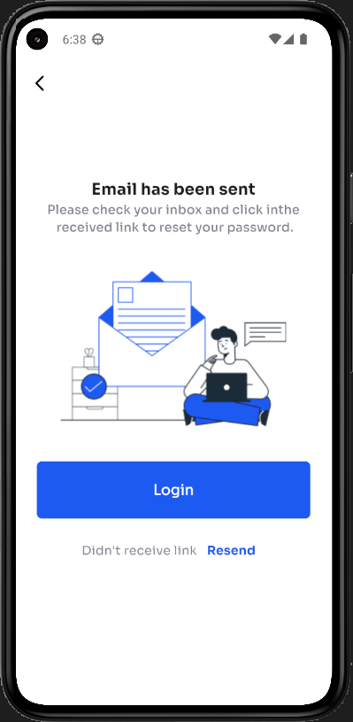
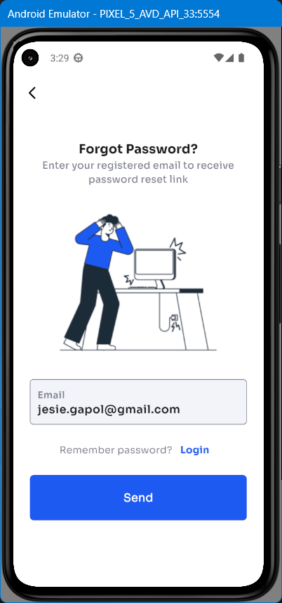
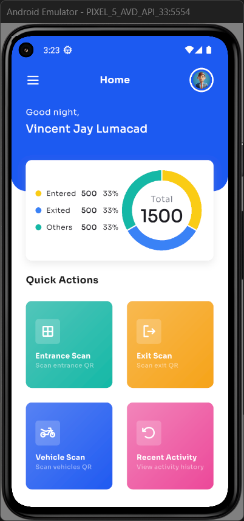
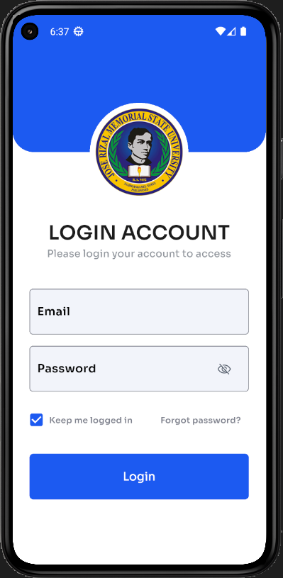
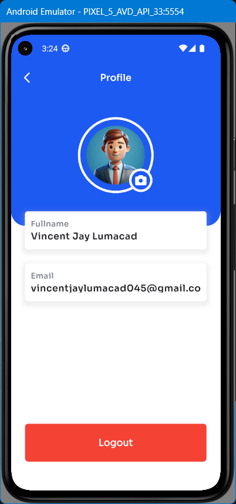
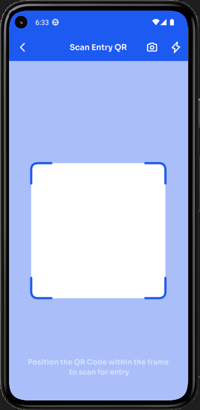
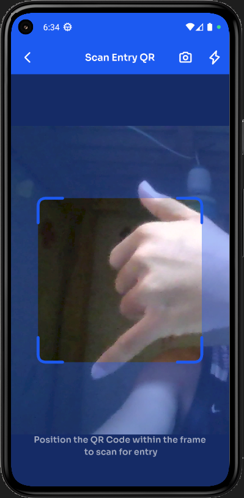
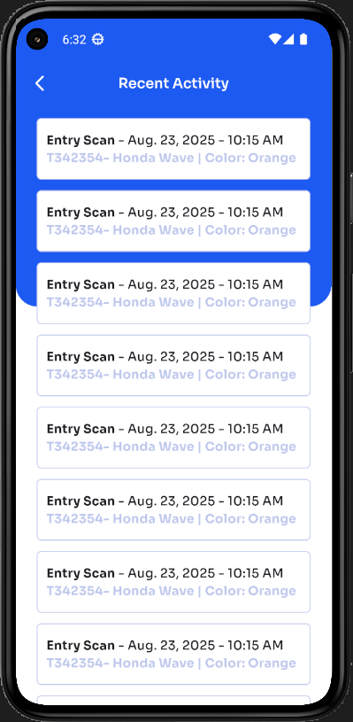
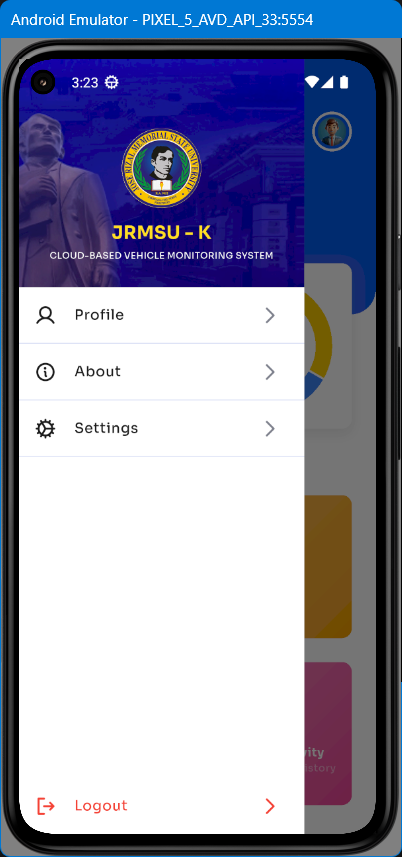
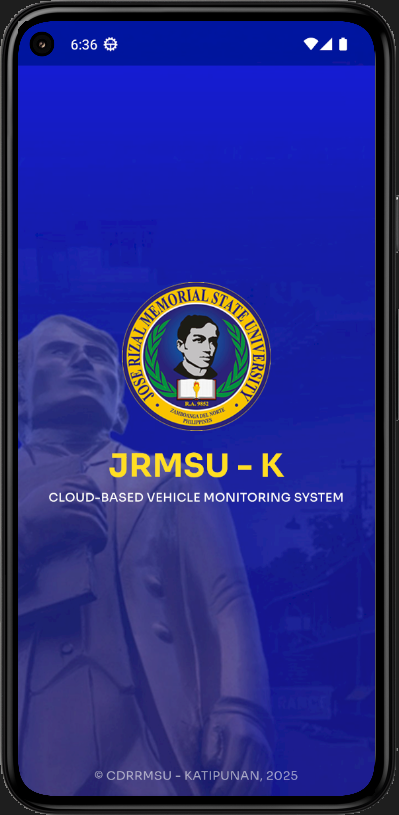

---

## 📱 Screenshots (Current Pages)

| Page | Preview |
|-------|---------|
| Email Sent Page |  |
| Forgot Password Page |  |
| Home Page |  |
| Login Page |  |
| Profile Page |  |
| QR Scanner Initialized |  |
| QR Scanner Loaded |  |
| Recent Activity Page |  |
| Sidebar |  |
| Splash Page |  |

---

## 👨‍💻 Developer

- Jesie Gapol

---

## 🛠 Tech Stack

- **Flutter** – Cross-platform UI
- **Dart** – Programming language
- **Firebase** – Backend services

---

## 🔄 State Management

- **Bloc (Business Logic Component)** for predictable state management

---

## 🚀 Features

- Secure user authentication
- QR code-based vehicle scanning
- Real-time data synchronization with Firebase
- User-friendly dashboard and activity logs
- Responsive UI optimized for mobile devices

---

## 📂 Project Structure (Relevant Sections)

lib/
├── features/
│ ├── auth/ # Authentication and user management
│ ├── vehicle_logs/ # Vehicle logs and monitoring
│ └── core/ # Shared themes, routes, and utilities
└── main.dart # Entry point of the application

yaml
Copy code

---

## 📝 Notes

- Images above are **current progress shots** of the app.
- More features and UI refinements are in progress.
