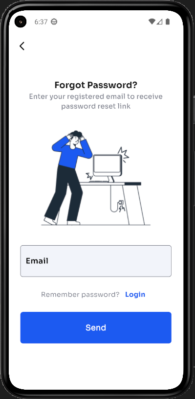
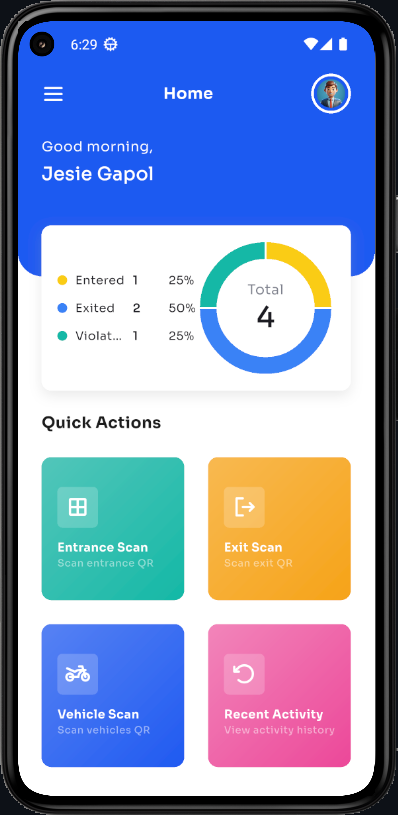
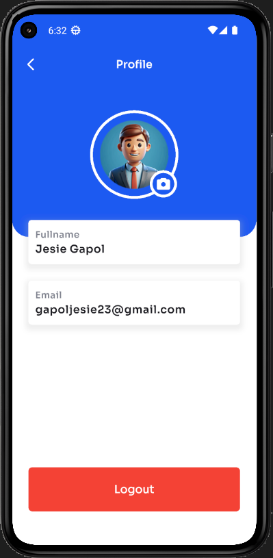

## 📱 Screenshots (Current Pages)

| Page                   | Preview                                                                         |
| ---------------------- | ------------------------------------------------------------------------------- |
| Email Sent Page        |                             |
| Forgot Password Page   |                               |
| Home Page              |                |
| Login Page             |                      |
| Profile Page           |                                 |
| QR Scanner Initialized |                                     |
| QR Scanner Loaded      |  |
| Recent Activity Page   |            |
| Sidebar                |                           |
| Splash Page            |           |

---

## 👨‍💻 Developer

- Jesie Gapol

---

## 🛠 Tech Stack

- **Flutter** – Cross-platform UI
- **Dart** – Programming language
- **Firebase** – Backend services

---

## 🔄 State Management

- **Bloc (Business Logic Component)** for predictable state management

---

## 🚀 Features

- Secure user authentication
- QR code-based vehicle scanning
- Real-time data synchronization with Firebase
- User-friendly dashboard and activity logs
- Responsive UI optimized for mobile devices

---

## 📂 Project Structure (Relevant Sections)
